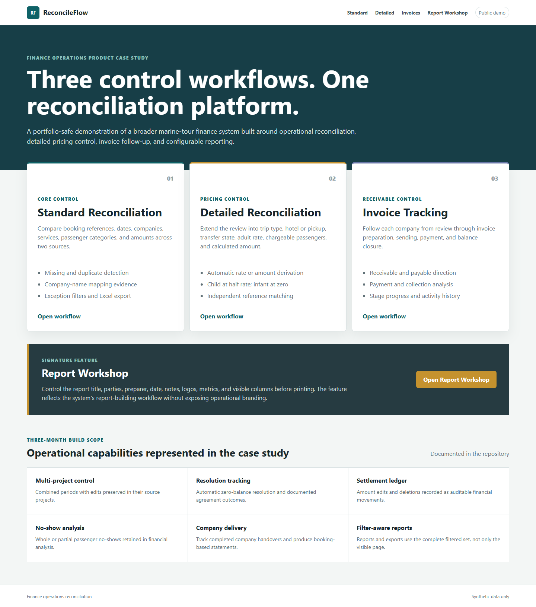
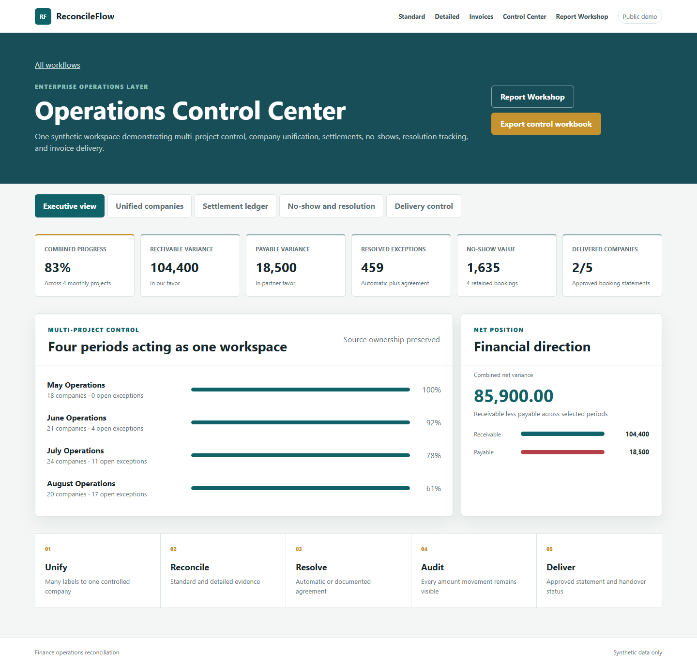
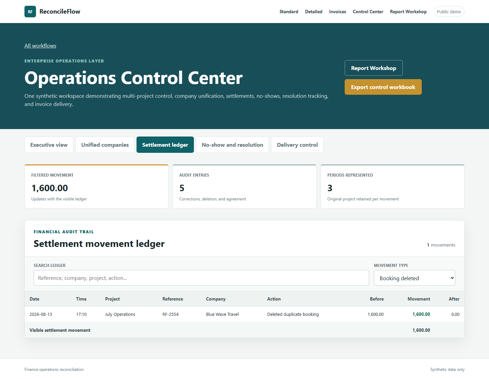
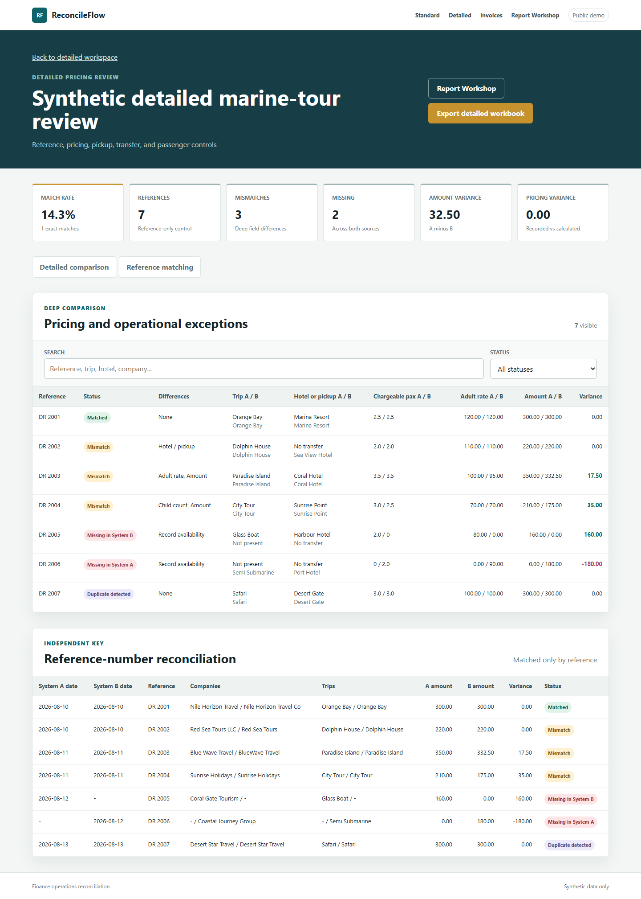
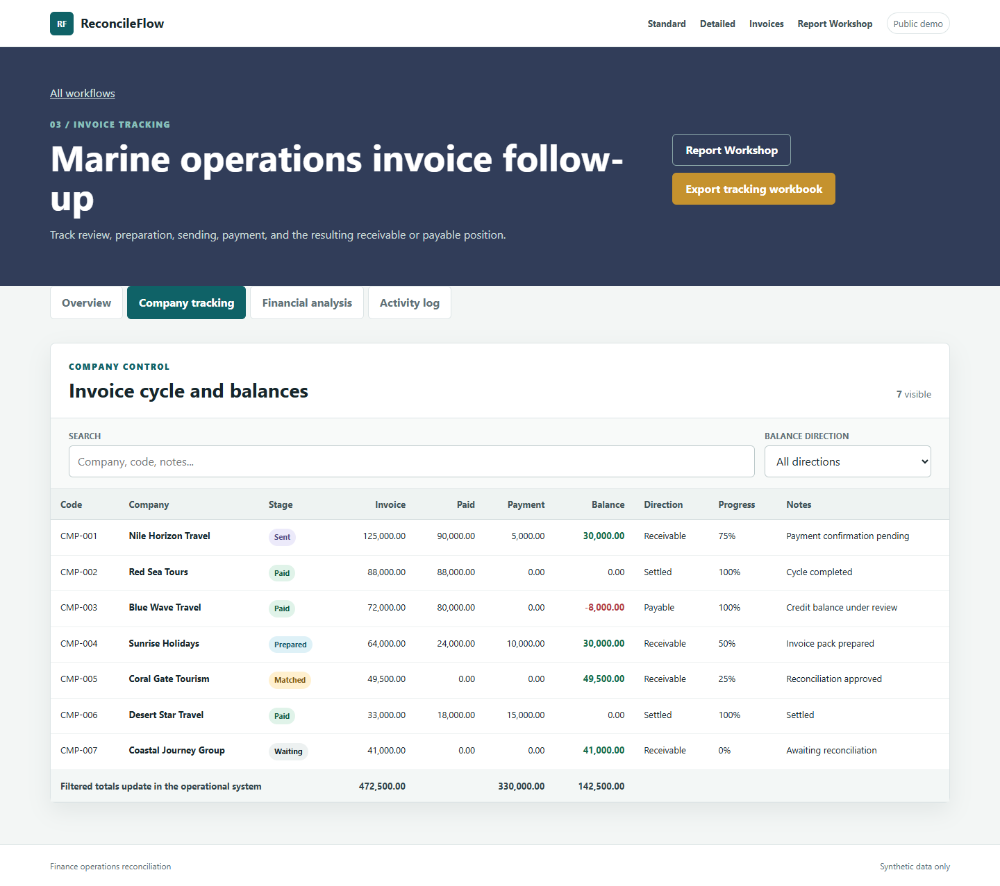
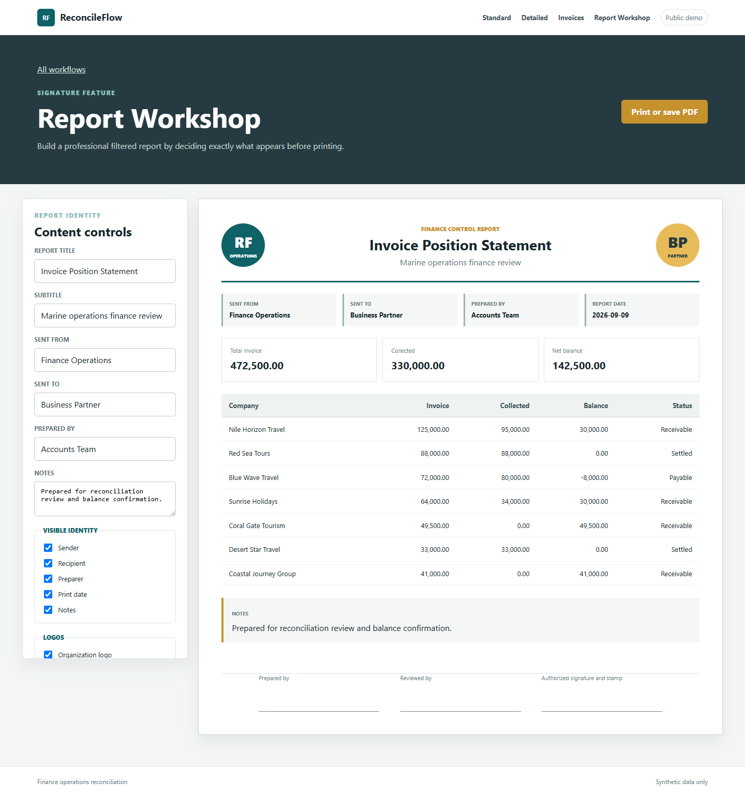
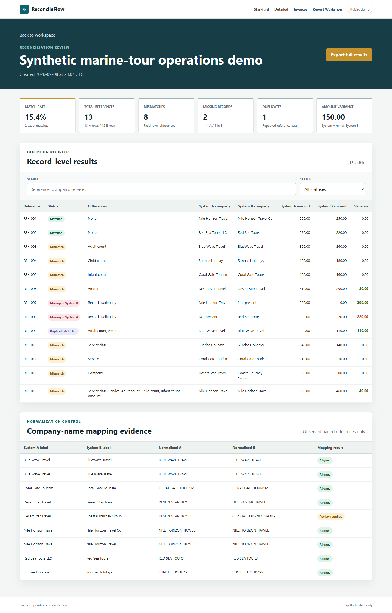
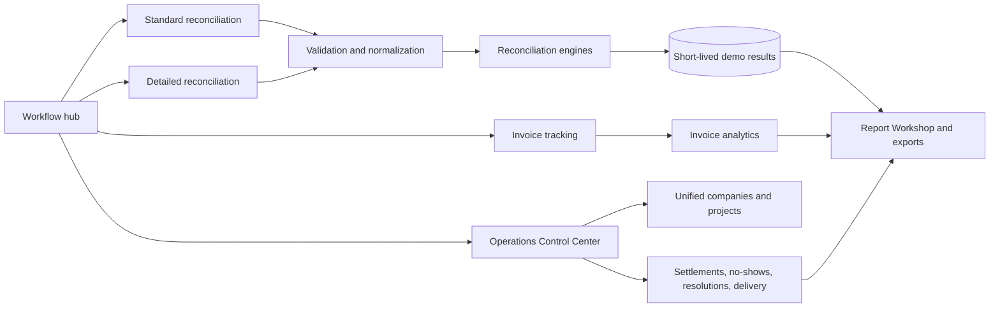

# ReconcileFlow

**Finance Operations Control System for marine-tour reconciliation and invoice follow-up**

ReconcileFlow is a portfolio-safe product case study built from three connected finance workflows: standard booking reconciliation, detailed pricing reconciliation, and invoice follow-up. A signature Report Workshop turns filtered operational evidence into a configurable professional report. The repository contains only synthetic records and generic organization names.



## Three product paths

### 1. Standard Reconciliation

Compare references, dates, companies, services, passenger categories, and amounts. Review missing records, duplicates, company-name mappings, field-level exceptions, and a complete three-sheet Excel export.

### 2. Detailed Reconciliation

Extend the control into trip type, hotel or pickup, transfer state, adult rate, chargeable passengers, calculated amount, and pricing variance. The child is valued at half the adult rate and the infant has zero cost. If rate or amount is missing, the available value and chargeable passenger count derive it. A separate reference view uses the reference number as its independent key.

### 3. Invoice Tracking

Follow each company through reconciliation, invoice preparation, sending, payment, and closure. The workspace separates total invoice value, recorded paid amount, additional payment, receivable, payable, collection progress, company ranking, and an activity log.

## Operations Control Center

The three core paths are supported by a live enterprise-control showcase built from the wider operational product. Four synthetic monthly projects act as one workspace while every record retains its source ownership.

- many-to-many company identity across projects, including explicit not-present states;
- a settlement ledger for corrections, deletions, restorations, and agreement movements;
- whole and partial no-show analysis with separate adult, child, and infant quantities;
- automatic zero-balance resolution versus documented agreement resolution;
- company delivery status and approved booking-statement readiness;
- persistent live filters whose totals follow the complete visible evidence.









## Signature feature: Report Workshop

The Report Workshop allows the reviewer to control the report title, subtitle, sender, recipient, preparer, date, notes, generic organization logos, visible metrics, and table columns before printing or saving to PDF. Choices remain available in the browser for the next report session.



[Open the generated one-page PDF example](output/pdf/report-workshop-sample.pdf)

## Live portfolio video

[Watch the live product walkthrough](output/video/reconcileflow-portfolio-demo.mp4). The 51-second recording uses only synthetic public data and shows real navigation, typed searches, live filters and totals, detailed pricing, unified companies, settlements, no-shows, delivery control, and an interactive Report Workshop preview.

## Business problem

Operational finance teams often receive the same marine-tour activity from two systems: an internal booking source and a counterparty or execution source. Manual spreadsheet matching becomes slow and difficult to audit when references are missing, company labels vary, passenger counts differ, services are entered differently, or the recorded amount changes.

ReconcileFlow turns that review into a repeatable control:

1. Validate two XLSX or CSV files.
2. Normalize references, labels, dates, and numeric fields.
3. Aggregate repeated references and flag duplicates.
4. Compare record presence and business-critical fields.
5. Present a summary, exception register, and company-mapping evidence.
6. Export the complete result set to Excel for follow-up.

## Standard live demo workflow

Use **Load synthetic demo** for an immediate walkthrough, or download the two sample workbooks and upload them manually.

The bundled scenario contains 13 booking references and intentionally produces every supported outcome:

| KPI | Result |
|---|---:|
| Total references | 13 |
| Exact matches | 2 |
| Field-level mismatches | 8 |
| Missing records | 2 |
| Duplicate references | 1 |
| Exact match rate | 15.4% |
| Net amount variance, A minus B | 150.00 |

These figures describe the synthetic demonstration dataset only. They are not production performance claims.



## Reconciliation logic

The reference is the primary matching key. Rows sharing a reference inside one source are aggregated, then the two sources are compared across:

- service date;
- normalized company name;
- normalized marine-tour service;
- adult, child, and infant counts;
- total amount, with a `0.01` comparison tolerance;
- presence in each source;
- repeated-reference detection.

Outcomes are mutually exclusive: `Matched`, `Mismatch`, `Missing in System A`, `Missing in System B`, or `Duplicate detected`. A duplicate remains visible even when its aggregated values also differ, making the underlying data-quality problem explicit.

See [Reconciliation logic](docs/RECONCILIATION_LOGIC.md) for definitions and limitations.

## Features

- One-click synthetic demonstration with no setup data.
- XLSX and CSV upload for System A and System B.
- Header validation and readable row-level validation errors.
- Unicode, whitespace, punctuation, date, and numeric normalization.
- Company alias mapping with original labels retained as evidence.
- Exact-match, mismatch, missing-record, and duplicate classification.
- Search and status filtering without page reloads.
- Responsive summary dashboard and horizontally safe data tables.
- Complete Excel export, independent of what is currently visible on screen.
- Detailed rate, chargeable-passenger, transfer, hotel or pickup, and pricing-variance controls.
- Independent reference-number reconciliation view and export.
- Invoice-cycle dashboard, receivable/payable analysis, stage colors, ranking, and activity history.
- Configurable Report Workshop with persistent display choices and print-ready layout.
- Multi-project Operations Control Center with company unification, settlement audit trail, no-show valuation, resolution tracking, and delivery control.
- Filter persistence and filter-aware totals demonstrated live across the control registers.
- CSRF protection, upload limits, archive expansion checks, security headers, and spreadsheet-formula protection.
- Automatic deletion of stored demo runs after 24 hours by default.
- Docker, Render Blueprint, test suite, and automated security gate.

## Technology

- Python 3.13
- Flask 3.1
- SQLite for short-lived demo results
- openpyxl for Excel input and export
- Waitress as the production WSGI server
- Server-rendered Jinja, semantic HTML, CSS, and small dependency-free JavaScript
- Pytest and GitHub Actions

## Architecture



The public demo is intentionally compact. Standard and detailed business logic live in separate engine modules; web concerns live in `app.py`; synthetic fixtures remain separate from application logic. The full operational evolution is documented in [Product case study](CASE_STUDY.md).

## Run locally

```powershell
python -m venv .venv
.venv\Scripts\Activate.ps1
pip install -r requirements-dev.txt
pytest
python app.py
```

Open `http://127.0.0.1:8000`.

On macOS or Linux, activate the environment with `source .venv/bin/activate`.

## Run with Docker

```bash
docker build -t reconcileflow-demo .
docker run --rm -p 8000:8000 --env SECRET_KEY=replace-this-value reconcileflow-demo
```

Open `http://127.0.0.1:8000` and confirm `http://127.0.0.1:8000/health` returns an OK response.

## Deploy on Render

The included `render.yaml` creates a Python web service, installs the locked runtime dependencies, generates a secret key, enables secure cookies, and stores short-lived demo results on Render's ephemeral filesystem.

1. Fork or clone this repository.
2. Run `python scripts/security_check.py` and `pytest`.
3. In Render, create a Blueprint and select the repository.
4. Confirm `/health` succeeds after deployment.

Render's official guides explain [Flask deployment](https://render.com/docs/deploy-flask) and [ephemeral versus persistent storage](https://render.com/docs/disks). Ephemeral storage is deliberate here: this portfolio demo does not promise permanent retention.

## Privacy and security

The demo does not save uploaded workbooks. It stores normalized reconciliation output for up to 24 hours, controlled by `RUN_RETENTION_HOURS`. A public instance has no user accounts, so it must not be used for confidential, personally identifiable, or production financial data. See [Security review](SECURITY_REVIEW.md).

## Repository map

```text
portfolio-demo/
|-- app.py
|-- reconcileflow/          # reconciliation engines and synthetic control-center data
|-- templates/              # English server-rendered interface
|-- static/                 # responsive visual system and table filtering
|-- sample-data/            # synthetic XLSX examples
|-- tests/                  # engine and end-to-end Flask tests
|-- scripts/                # sample-data generator and security gate
|-- docs/                   # logic notes and portfolio screenshots
|-- Dockerfile
|-- render.yaml
`-- README.md
```

## Professional context

This project is presented from a finance and accounting operations perspective. It demonstrates requirements discovery, reconciliation-control design, exception analysis, data-quality thinking, and the ability to translate a manual spreadsheet process into a tested working tool.

## Honest scope

- This is a portfolio demonstration, not a multi-tenant accounting product.
- Company mapping uses an explicit alias dictionary; it does not claim machine learning.
- SQLite and the current in-process workflow are appropriate for a controlled demo, not high-concurrency production processing.
- Authentication, role permissions, database encryption, background jobs, and a managed database would be required before production use.
- The match-rate KPI measures exact matched references divided by all unique references; it does not measure monetary accuracy.

## Project documentation

- [Full product case study](CASE_STUDY.md)
- [Reconciliation logic](docs/RECONCILIATION_LOGIC.md)
- [Security review](SECURITY_REVIEW.md)
- [Live product walkthrough](output/video/reconcileflow-portfolio-demo.mp4)
- [Report Workshop PDF sample](output/pdf/report-workshop-sample.pdf)
